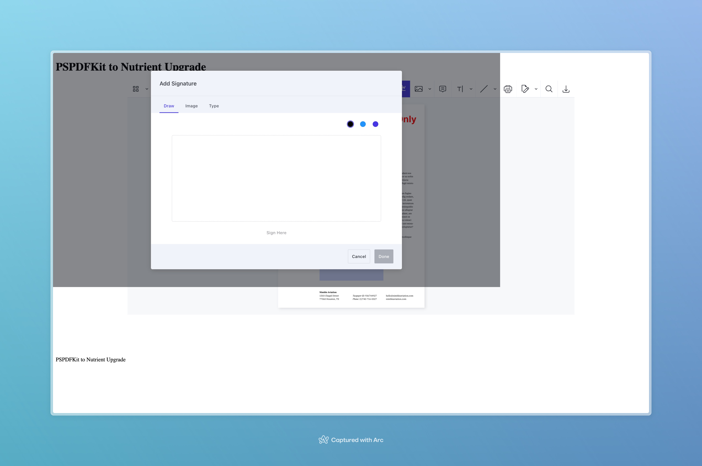
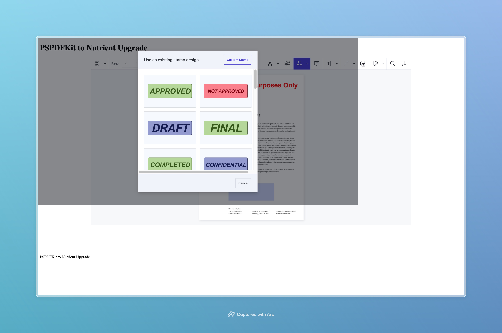

# PS PDF Kit 2024.1.3 Upgrade to Nutrient 1.2.0

This project is a [MRE](https://stackoverflow.com/help/minimal-reproducible-example) Minimal Reproducible Example for the signature pad being misaligned when the PDF viewer is in a styled form tag. 

See the [Angular Projects Readme](./pspdfkit-2024-1-3-to-nutrient-1.2.0/README.md)

